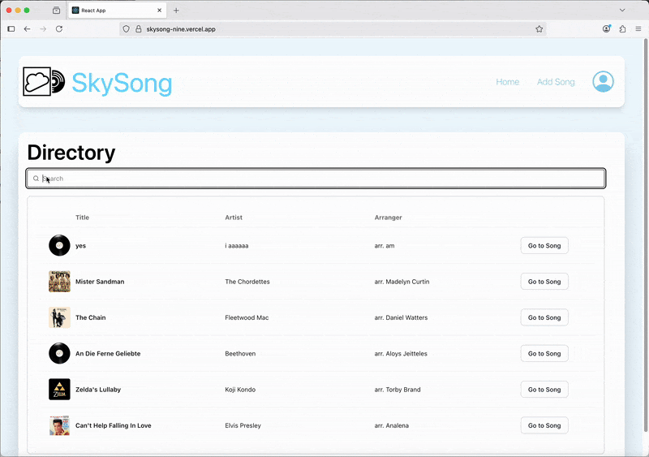

# SkySong 🎶

_A web app for learning music._

<!-- Badges -->

🔗 **Live Demo**:  https://skysong-nine.vercel.app/

## Preview

<!-- Replace with screenshots or a GIF demo -->

## Features:

| Feature                   | Description                                                  |
| ------------------------- | ------------------------------------------------------------ |
| Song Library              | Searchable by title, artist, arranger                        |
| Built-in Music Player     | Mute parts, transpose, adjust tempo, zoom in/out, export PDF |
| Admin Role                | Add songs (edit/delete coming soon)                          |

> **Note:**  
>
> - The login feature currently exists for **admin users only**. Admin privileges are **manually assigned by the owner of this repository**. Creating a new login in the live demo will not grant admin access.  
> - This login feature is intended for **future enhancements**, such as organization/group membership, when members will be required to log in.

## Tech Stack:

- **Frontend:** React, TailwindCSS, DaisyUI  
- **Database:** PostgreSQL / Supabase  
- **Deployment:** Vercel  
- **Music Rendering/Playback:** [OpenSheetMusicDisplay (OSMD)](https://opensheetmusicdisplay.org/) — includes a sponsor-only private package

  

## Local Installation (Personal Use)

Full local setup steps are documented in [INSTALLATION.md](INSTALLATION.md)
. Access to private packages and credentials is needed for local setup, but **you do not need this** to view the live demo or GIF previews.

## Why I Built This

I created **SkySong** with my _Filipino A Capella group_ in mind. The goal was to make it easier for members to:

- Follow along visually with the score as the music plays
- Isolate or mute parts to practice their own voice part
- Upload arrangements directly (via admin access)

This project allowed me to combine my passion for music and technology, while building something useful for real collaborators.

## Future Improvements

- [ ] Support multiple organizations, so admins can share music with specific groups only
- [ ] Song categories for improved searching/filtering
- [ ] Edit and delete features for song entries
- [ ] Fully responsive mobile UI

## About Me

Kaylee Ulep

- LinkedIn: https://www.linkedin.com/in/kaylee-ulep/
- Email: kaylee.ulep@gmail.com
